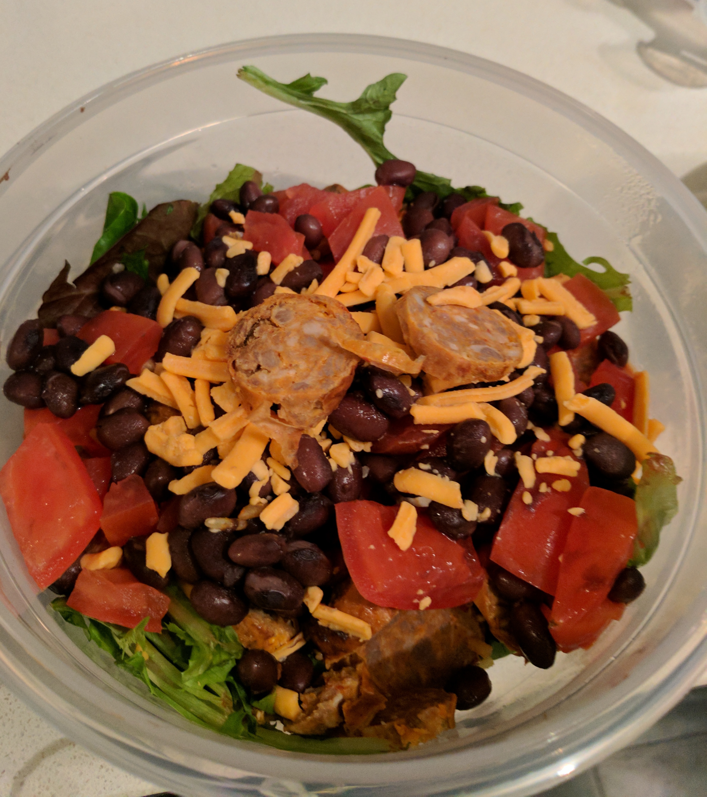

# Measured out Meals


## Meals
<!--No hands for on the mouse for this commit-->

### Teriyaki Edememe - 655 Calories


|Ingredients|Serving|Calories|Fats|Carbs|Proteins|
|--------|:--:|:--:|:-----:|:---:|:--:|
| Quinioa | 3/4 cup  | 170 | 2.66 | 31.62 | 6 
| Chicken | 100g  |  172 | 3.52 | 0 | 30.6
| Brocolli | 3/4 Cup | 23 | 0 | 5 | 2 
| Shredded Carrots | 1/2 Cup | 39 | 0.35 | 9 | 1 
| Edameme (SoyBean) | 3/4 cup | 190 | 9 | 15 | 17
| Green Onion | N/a | 0 | 0 | 0 | 0 
| SoySause + Sirachia | Lots | 100 | 0 | 25 | 0 



#### Totals: 35g Fat , 60 Carb , 27 Pro

|Ingredients|Serving|Calories|Fats|Carbs|Proteins|
|--------|:--:|:--:|:-----:|:---:|:--:|
| GroundBeef | 100g  | 276 | 18.5 | 0 | 25 
| Spanish Rice | 3/4 Cup  |  159 | 2.7 | 30.51 | 3.5
| Tomato | 1/2 Cup | 26 | 0 | 6 | 1 
| Blackbean | 1/2 Cup | 109 | 0.35 | 19.87 | 7.25 
| Corn | 1/2 Cup | 70 | 0.5 | 16 | 2
| Cheese | 20 grams | 80 | 7 | 0 | 5 
| Lettuce | Lots | 0 | 0 | 0 | 0 

### Marks - Mexican Black bean - 686 Cal 


#### Totals: 35g Fat , 60 Carb , 27 Pro

|Ingredients|Serving|Calories|Fats|Carbs|Proteins|
|--------|:--:|:--:|:-----:|:---:|:--:|
| GroundBeef | 100g  | 276 | 18.5 | 0 | 25 
| Spanish Rice | 3/4 Cup  |  159 | 2.7 | 30.51 | 3.5
| Tomato | 1/2 Cup | 26 | 0 | 6 | 1 
| Blackbean | 1/2 Cup | 109 | 0.35 | 19.87 | 7.25 
| Corn | 1/2 Cup | 70 | 0.5 | 16 | 2
| Cheese | 20 grams | 80 | 7 | 0 | 5 
| Lettuce | Lots | 0 | 0 | 0 | 0 

### Sausage Black bean - 686 Cal 


#### Totals: 35g Fat , 60 Carb , 27 Pro

|Ingredients|Serving|Calories|Fats|Carbs|Proteins|
|--------|:--:|:--:|:-----:|:---:|:--:|
| Sausage | 100g  |  317 | 25 | 4 | 20 
| Spanish Rice | 3/4 Cup  |  159 | 2.7 | 30.51 | 3.5
| Tomato | 1/2 Cup | 26 | 0 | 6 | 1 
| Blackbean | 1/2 Cup | 109 | 0.35 | 19.87 | 7.25 
| Cheese | 20 grams | 80 | 7 | 0 | 5 
| Lettuce | Lots | 0 | 0 | 0 | 0 


### Mediterranean bowl <br> 650 Cal 


164(chicken) + 175 (quinoa) + 80(feta) + 78 (1/2 cup olives) + (50) Veggies 

Veggies
1/2 Cup tomatoe (20) <br>
1/4 Cup Roasted Red Pepper (10) <br>
1/3 Cup of red onion (15) <br>
Lettuce

Optional: Almonds 80 cals

### Marks - Bean Sprout and carrot chicken stirfry <br> 350 calories


284 Calories =  shreded carrots 50g (20) + 1 Cup of Beansprouts (20) + 70 (2 TEASPOONS spoon of bacel) + 164 for portion of chicken +  spinich (0)

<br>
<br>
# Log
## Oct 10

* 	Chest workout (Great workout)

apple - coffee - avacado toast egg = 450
coffee - bannana = 150
lunch (mediteranian) = 650
dinner(chicken stir) = 350 
coffee (50) + snack +150 = 200
**Snacks**    <br>
350 Calories: Snacks - Coffee , Bannana, Tomato,  <br>
**Breakfast** <br>
450 Calories:  Avacado Toast + Coffee <br>
**Lunch**     <br>
650 Calories: Lunch Salad <br>
**Dinner**    <br>
300 Calories:   <br> 

*Total <br> 1700 Calories*

## Oct 11

**Excercise**

* 	Frisbee (2hr)
*  Bike (Lamport/Cherry)

**Snacks**    <br>
840 Calories: beansprouts(100) + 130 + 150 + 120 +100 + 100 + 140  <br>
**Breakfast** <br>
350 Calories:  Avacado Toast + Coffee <br>
**Lunch**     <br>
300 Calories: Lunch Salad + coffee <br>
**Dinner**    <br>
0 Calories:   <br> 

*Total <br> 1700 Calories*


## Oct 12

**Excercise**

* 	Frisbee (1hr)
*  Back(20) + Shoulders (8)
*  Bike (St Mikes and back)
	

**Snacks**<br>
875 Calories: Apple(100) Bannana(121) Chickapees(150) Protein Shake(130) + 1 milk 1 suger coffee(75) + Protein on Tomato(200) <br>
**Breakfast**<br>
390 Calories: Coffee(116) bagel(220) + becel(40) <br>
**Lunch**<br>
650 Calories: Mediteranian Lunch(650) <br>
**Dinner**<br>
300 Calories: BeanSproutStirfry(350)


*Total <br> 2215 Calories*


## Oct 13

**Excercise**

*  Frisbee (1hr)
*  Triceps(12) + Shoulders (8)
*  Bike (St Mikes and back)

**Snacks**    <br>
806 Calories:  Apple(100) Bannana(121) Chickapees(150) Protein Shake(130) + 1 milk 1 suger coffee(75) + 30 calories (coffee milk work) + Protein/green tea(140), tomato (60) <br>
**Breakfast** <br>
350 Calories: Avacado toast egg  <br>
**Lunch**     <br>
650 Calories:   <br>
**Dinner**    <br>
350 Calories:   <br> 

*Total 2,156 <br>  Calories*

## Oct 14

*  Frisbee (1hr)
*  Biceps (14) + Chest (4)
*  Bike (Lamport and back)

**Snacks**    <br>
680 Calories:  Apple(100) Bannana(121) Chickapees(150) Protein Shake(130) + 1 milk (3) coffee + 30 calories (coffee milk work) + Protein/green tea(140) +60 2 large green tea with milk <br>
**Breakfast** <br>
350 Calories:  300 Calories: Avacado + coffee  <br>
**Lunch**     <br>
650 Calories:   <br>
**Dinner**    <br>
350 Calories:   <br> 

*Total <br> ~2090 Calories*


## Saturday Oct 15

*  Frisbee (1hr)
*  Chest (14) 
*  tris (4)

**Snacks**    <br>
X Calories:   Apple(100) Bannana(121) Protein Shake(130)*2 + 200milk from coffees<br>
**Breakfast** <br>
350 Calories:  300 Calories: Bagel + coffee  <br>
**Lunch**     <br>
800 Calories: Market Salad with chicken <br>
**Dinner**    <br>
400 Calories:  Teriaki Bowl Freshii <br> 
*Total <br> 2250 Calories*

## Sunday Oct 16 
*  Frisbee (1hr)
*  Bike St Mikes
*  abs (8) 

**Snacks**    Apple (100), Bannana (130), 2 Protien shakes (130*2) + 200 milk from coffee + lunch with parents jack astors 450 + teriaki twist (no chicken)(400) + teraki twist with chicken (600). 

*Total <br> 2,190 Calories*

## Monday Oct 16 
* Back + Abs 
* Ran 3 km -> 40 mins

Apple (100), Bannana (130), 1 Protein shake (130) + Chickapeas (150) + 200 milk from coffee + teraki twist with chicken (650) *2 + breakfast (300)<br> 
*Total <br> 2,310 Calories*

## Sunday Oct 23 
* Shoulders + Abs 
* Ran 3 km -> 35 mins

*Total <br> 3000 Calories*

## Monday Oct 24 
* Ran 3 km -> 30 mins
* 6 Chest workouts. 
* Meeting Muck

```
100 apple 
100 bannana 
300 coffee
700 lunch 
300 breakfast with bread
200 shreded carrots and ketchup (it was good)
600 apples bannanas snacking
300 dinner
```
##### Total ~2500 Calories


## Tuesday Oct 25 
* 8 chest, 5 biceps. (Morning)

```
120 Coffee
300 breakbreakfaset
40 coffee work 
100 apple at work
```


<br>
<br>
<br>
<br>


## Wednesday Oct 26
* Shoulders 14 exercises

```
350 breakfast
150 coffee work 
100 bannana at work
700 lunch
700 dinner
300 snacks
```

~2300

## Thursday Oct 27
* Back 12 exercises
* Ran 3k

```
350 breakfast
150 coffee work 
100 apple at work
700 lunch
700 dinner (loblaws) - chicken skewers + salad.
180 calories carrots and dip (+ extra dip later)
180 green tea protein shake. 
100 calories yogurt
```
~2300

## Friday Oct 28
* Triceps 12 Excercise

```
150 2 coffees (2m 1s with caramel)
700 lunch
100 Bannana
130 Coffee + whey
100 Toffee treats
350 Veggies and dip
350 Veggies after work before drinks
50 Coffee
```
~2000 Calories


## Saturday Oct 29
* Biceps 14 Excercises
* Ran 3 miles

```
200 Calorie breakfast
100 Pear
100 Apple
160 Calorie coffee + Whey
80 Calories from random coffees.
650 Terriaki twist
Chicken bites / pizza / etc etc etc
150 Snacking

```
~3000

Bad....

## Sunday Oct 30
* Back + shoulders
* Ran 3 miles

```
300 Calorie breakfast
160 Calorie coffee + Whey
150 Coffees with milk
250 Coffee Cake
200 Apple , Pear 
700 Terriaki Twist
500 Loblaws Lunch
150 Pomegranete
250 Apple/Cheese
```
~2700 Calories

## Monday Oct 31
* Chest 12 workouts - Bench/Decline/Incline (6 rep at 205!)


```
320 Black beans + Coffee 
700 + 700 
150 Snack
100 Ketchup veggie 
100 Coffees  

```

~ 2100 

####Additional Goals
* 	Got Windows running on old laptop 
*  Went to meeting


## Tuesday Nov 1
* Ran 3miles
* Played frisbee. 

```
50 Coffee
100 Banana 
200 Coffee milk 
700 Lunch Steven
700 Dinner
100 Yogurt
100 Candies
300 chicken
```
2250

####Additional Goals
*  Sold computer
*  Lunch with steven

## Wednesday Nov 2
```
50 Coffee
1000 For protein + teriaki twist
1000 For Dinner
200 veggie snack

```

####Additional Goals
* Wait until 4pm until first meal
* start tracking protein


## Thursday Nov 3

####Additional Goals
* make a goal card.
* Change your self image. See yourself as the person you want to become. make a goal card . read it everyday.
* Meeting for tommorow.

<br><br><br>
# Five day break
<br><br><br>

## Tuesday November 8
No workout

```
1200 Calories 
Breakfast, sausage + bread + everything
1200 Dinner with parents
```

## Wednesday November 9

```
100 Calories from 2 coffees
800 Calories Terriaki Twist
1

```

## Thursday November 10
Biceps + Back 

```
Hard to tell with parents dinner
100 Calories from 2 coffees
800 Calories Terriaki Twist
```
2400 calories

## Friday November 11


```
1400/	60 g Calories 2 Terriaki twists - 1400
270	 /	20  3 Eggs + some cheese
150 /  

2 Coffees 
2 Chicken meals at end 
```
2600 calories 
Nachos 


# Items
carb/fat/pro = cal

large milk coffee is 30 cals

coffee packet is 5 cals

1/2 cup olives 
3.5/7.5/0 = 78 calories

2 table spoon sliced almonds
2/8/2 = 80 calories

2 table spoons of avacado hummus <br>
6/2.5/2 = 60 cal

1 Slice of bread <br>
20/2.5/5  = 120 calories

100g cooked chicken <br>
0/3.5/30 = 164

3/4 cup cooked quinoa<br>
0/3/35 = 175 cals

1 Egg<br>
1/5/7 = 85 calories

1 Large banana<br>
31/0/1.5 = 121

large coffee 2 milk 1 sugar <br>
18/2/4 = 106

large coffee 2 milk <br>
6/2/6 = 60

30g feta cheese <br>
1.2/6/4 = 79 calories

1 Large tomato<br>
7/0/2 = 32 calories
 
1 Apple  <br> 
25/0/0 = 100 calories


## Snacks
* Tomato and Feta <br>115 Calories <br> 8 / 6 / 6 <br> 30 grams of feta, and a full tomato

* Banana <br> 121 Calories <br> 31 / 0 / 1.5 

* Apple <br> 100 Calories <br> 25 / 0 / 0 

* Chickapees (1/3 cup) <br> 150 Calories <br> 
	1 tablespoon maple serup <br> 1/3 cup chickapea
	 
* Protein shake (1/3 cup) <br> 130 Calories <br> 
 	4 / 2 / 25	

## Breakfast 
Coffee (2M1S) - 18/2/4 = 106 calories <br>
Coffee (2M) - 6/2/6 = 60 calories

* Piece of toast with avacado and egg <br> 265 calories <br> 26 / 5 / 7 

<br> <br> <br> <br> <br>
#Template 
## Oct 13
**Snacks**    <br>
X Calories:   <br>
**Breakfast** <br>
X Calories:   <br>
**Lunch**     <br>
X Calories:   <br>
**Dinner**    <br>
X Calories:   <br> 
*Total <br> X Calories*